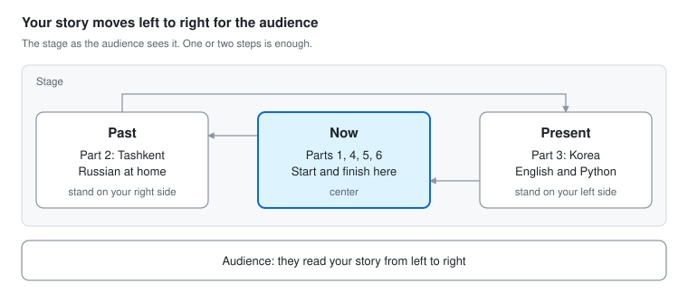

# Ice Breaker: Another World

By Azizjon Kasimov · Daejeon Toastmasters · prepared Oct 5, 2026

## At a glance

Your speech is on Saturday, Oct 10, 2026. It must run 4 to 6 minutes, so aim for 5:00.

| What | Details |
| --- | --- |
| Title | Another World |
| Project | Ice Breaker, the first project in Pathways |
| Purpose | Introduce yourself to the club and learn the basic structure of a speech |
| Time | 4 to 6 minutes. The timer shows green at 4:00, yellow at 5:00, red at 6:00 |
| Your target | 5:00, about 570 words at a calm pace |
| Main message | When your language changes, your world changes too. |
| What the evaluator looks at | Clarity, vocal variety, eye contact, gestures, audience awareness, comfort level, interest |

This is your first speech, so the evaluator may skip the scores and only write notes. Source: [Ice Breaker evaluation resource, Toastmasters International](https://www.toastmasters.org/websiteapps/pathways/tm100101_scorm12_20151004/tm100101/resources/8101e%20evaluation%20resource.pdf).

## The speech

The full script is about 570 words, so about 5 minutes at a calm pace. Say the **bold** lines slowly. Lines in *italics* are notes for you, not words to say.

### 1. Hello in four languages · 0:00

Привет. *(pause)* Salom. *(pause)* 안녕하세요. *(pause)* Hello.

Toastmaster of the day, fellow Toastmasters, and dear guests.

You just heard "hello" in four languages: Russian, Uzbek, Korean, and English. My name is Azizjon. *(pause)* Azizjon Kasimov. I am from Uzbekistan, and I am an AI engineer here in Daejeon.

Here is something strange. Russian is my first language. I grew up with it. **But now, speaking Russian is hard for me.** How did that happen? Let me tell you about my two worlds.

### 2. My first world · 0:50

*Step to your right side (the past).*

I grew up in Tashkent, the capital of Uzbekistan, in a Russian-speaking family. At home, everything was in Russian. My family, my childhood, my first memories. All in Russian.

And Uzbek, the language of my country? Yes, I said "Salom" at the start. But I can barely speak Uzbek. *(pause, small shrug)*

So my first world was in Russian. For me, it was just normal. I never thought about it. When you live inside a language, you don't see it. A fish does not see the water.

### 3. My second world · 1:30

*Walk to your left side (the present).*

Then I came to Korea to study at Woosong University, here in Daejeon. And a new world started.

I started learning Korean for daily life. 아직 공부 중이에요. *(pause, smile)* I am still learning. But my main language here became English. At first, it was just a tool for work. I became an AI engineer. I build models that forecast solar power, find hidden problems in data, and predict prices.

At work, I speak one more language. A programming language: Python. *(pause)* Python is the perfect listener. It never interrupts me. It never gets bored. But when I make one small mistake, it tells me right away. *(robot voice)* "Error." *(pause)*

Slowly, English moved from my work into my whole life. Today I speak English almost all day. With friends, with new people, and at home with my girlfriend. **English is not my work language anymore. It is my life language.**

### 4. The strange part · 2:45

*Come back to the center (now).*

And here is the strange part. *(Point back to the past side.)* When I look back at the years when I spoke mostly Russian, they feel like another world. And now, when I speak Russian, I have to stop and search for words. **My first language became my second language.** *(pause)*

This taught me something. A language is not just words. It is a whole world. **When your language changes, your world changes too.**

### 5. Something new this year · 3:25

But recently, I noticed one more change. This one is not a new language. It is a new feeling.

Talking to people became easier. More than that, it became fun. I can share my ideas, and people understand me.

This year, I tried new things. I started a small tech meetup here, called Daejeon Global Tech Coffee. And last month, I started teaching English as a volunteer. It was my first time ever teaching English. Step by step, it got easier.

### 6. Why I am here · 4:05

I want more of that feeling. That is why I am here. I came to this club three times as a guest. Then my girlfriend and I joined the club together.

My goal is simple: take every role I can, and speak as much as I can. And I like that here, people tell you what you did wrong. Just like Python. *(pause)* But much more kindly.

**Every language gave me a new world. Now I want to get better at sharing my world with other people.** Today, I shared a little of it with you.

I started with "hello" in four languages. Let me finish with "thank you" in four languages.

Спасибо. Rahmat. 감사합니다. Thank you.

## Cue card

Print this part and keep it on the lectern. Say the opening and the closing word for word. For the middle, just follow the keywords.

1. **0:00 · Hello in four languages.** Привет, Salom, 안녕하세요, Hello. Name twice. AI engineer. Strange: Russian is hard now. Two worlds.
2. **0:50 · First world (step right).** Tashkent. Russian family: home, childhood, memories. Uzbek? Barely speak it. Just normal. A fish does not see the water.
3. **1:30 · Second world (walk left).** Woosong. Korean: 아직 공부 중이에요. English for work. Solar, data, prices. Python: perfect listener, "Error." English is my life language: friends, new people, girlfriend.
4. **2:45 · The strange part (center).** Russian years feel like another world. Search for words. First language became my second. Language changes, world changes.
5. **3:25 · Something new.** Not a new language, a new feeling. Easier, fun. Global Tech Coffee. Teaching English. Step by step.
6. **4:05 · Why I am here.** More of that feeling. Guest three times, then joined with my girlfriend. Every role. "Like Python, but more kindly." Share my world. Thank you in four languages.

The green light (4:00) should come around part 6. If you see yellow (5:00) before part 6, jump straight to "Every language gave me a new world."

## Before the meeting

Send your intro to the Toastmaster by Friday, Oct 9, 2026, and talk to your evaluator for two minutes before the meeting starts.

### Intro for the Toastmaster

Send this to the Toastmaster of the day, so they can introduce you:

> Our next speaker is a new member of our club. He is an AI engineer, and he runs Daejeon Global Tech Coffee, an English-friendly tech meetup here in Daejeon. Today he gives his Ice Breaker, the first project in Pathways. His speech is 4 to 6 minutes long, and the title is "Another World". Please welcome Azizjon Kasimov!

### Notes for your evaluator

Give your evaluator the [Ice Breaker evaluation form](https://www.toastmasters.org/websiteapps/pathways/tm100101_scorm12_20151004/tm100101/resources/8101e%20evaluation%20resource.pdf) and ask them to watch three things:

1. **Pace:** Was I too fast anywhere? Did my pauses work?
2. **Eye contact:** Did I look at all parts of the room?
3. **Clarity:** Were any words hard to understand?

### Checklist

- [ ] Confirm your speaking slot with the club's VP Education
- [ ] Ask the VP Education if you need to choose your Pathways path in Base Camp first
- [ ] Send the intro above to the Toastmaster of the day
- [ ] Give the evaluation form to your evaluator
- [ ] Print the cue card
- [ ] Ask someone to film your speech on your phone
- [ ] Arrive 15 minutes early and try the three spots on the stage

## Practice plan

About 20 minutes a day is enough. Tick off each day when it is done.

- [ ] **Mon, Oct 5:** Read the script out loud two times. Change any word that does not sound like you.
- [ ] **Tue, Oct 6:** Record yourself on your phone and check the time. Aim for 4:45 to 5:15. Make any line where you stumble simpler.
- [ ] **Wed, Oct 7:** Learn the opening and the closing word for word. Practice the middle from the cue card only. Small changes in wording are fine.
- [ ] **Thu, Oct 8:** Full run standing up, with the stage walk and gestures. Do it in front of your girlfriend and ask her: "Which part was the most interesting? Where did I lose you?"
- [ ] **Fri, Oct 9:** Two full runs with a timer, then stop. Send your intro to the Toastmaster.
- [ ] **Sat, Oct 10:** One calm run in the morning. Then rest. You are ready.

## Delivery tips

Three things matter most: slow down on the bold lines, wait for laughs, and use the stage to show your two worlds.

The audience reads your story from their left (the past) to their right (the present), like a line of text. That is why you stand on your own right side for Tashkent.

- **Wait for laughs.** After "I can barely speak Uzbek", after "Error.", and after "much more kindly". Do not talk over the laugh.
- **Slow down on the bold lines.** Pause before and after each one. These are the lines people will remember.
- **Three simple gestures.** Shrug a little and smile for "I can barely speak Uzbek". Point back to the past side for the Russian years. Open both hands to the audience for "sharing my world with other people".
- **Eye contact.** Say each opening "hello" to a different person. After that, finish each sentence looking at one person, then move to another part of the room.
- **Clear sounds on repeated words.** You say "language" 17 times and "world" 8 times, so give them a clear W: LANG-gwij, wurld.
- **Notes are fine.** Keep the cue card on the lectern. If you lose your place, look down, smile, and go on. Nobody else knows your script.
- **Nerves are normal.** Before you stand up, breathe out slowly two times. Most members in that room gave an Ice Breaker once too.
